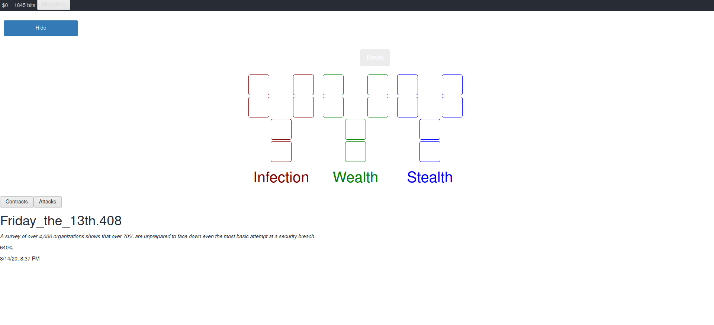

# How To Train Your Skynet (HTTYS)

An idle-game about being an e1337 hacker and training viruses to take over the world. The game features an attack system, a contract system, and a skill-tree system.
That attack system works by allowing you to choose from a variety of different attacks you can deploy. After a certain amount of time the attacks will finish and will reward you with a random amount of bits. The contract system will allow you to pick certain contracts to complete. Some will require you to run certain attacks in order to finish your contract. Then once the contract is finished you will be rewarded again either in bits or money. Lastly you can use your bits and convert them into money which will allow you to buy more skill points to add to you skill tree. The skill tree allows you to apply modifiers to your game such as faster bit generation, money loans, bit loans, and detection avoidance.

As you continue to play you will slowly get detected by your adversaries. If your detection reaches 100% you will be given a strict penalty to your bit generation. After one day has passed your detection rating will be reset. Strategically use your skills, contracts, and attacks to gain as much money and bits as you can while avoiding detection. The game features a cookie save feature that will record your game state after you exit and will resume once you return. See how far you can last without getting detected.  

## Live Demo

You can play the game on our [live demo server](https://httys.mandatoryfun.xyz)

## License

This project uses the [GNU GPL v3](LICENSE).

## Authors

* Bar Movshovich
* Dmitri McGuckin
* Ryan Jones

## Screenshots

## Development and Contribution

### Clone the Repo

`git clone https://github.com/dmitri-mcguckin/httys`

### Install dependencies

`$` `npm install --save`

### Start the Development Server:

`$` `ng serve --open`

*(The server starts on http://localhost:4200 and will automatically reload on source file changes.)*

### Build

`$` `ng build --prod`

### Unit Tests

`$` `ng test`

Tests are run with [Karma](https://karma-runner.github.io).

### End-to-end Tests

`$` `ng e2e`

Tests are run with [Protractor](http://www.protractortest.org/).

### Further help

**Angular Help:**

`$` `ng help`

**Issues Board:**

[Issue Tracking board](https://github.com/dmitri-mcguckin/httys/issues)
